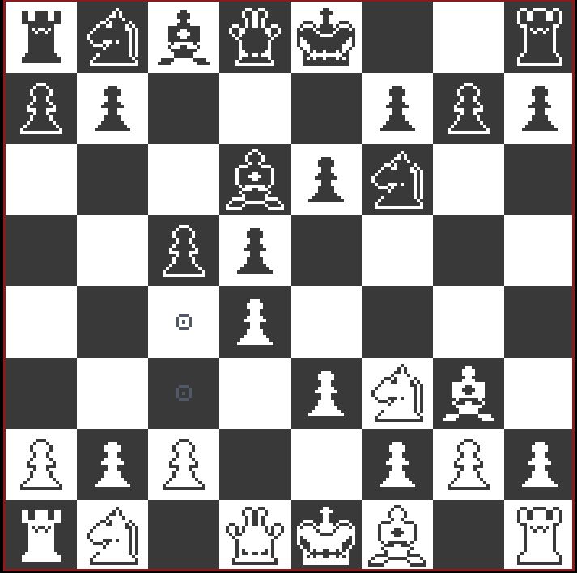

# Chess game

A Chess game written in V. Please feel free to contribute. All chess moves

## Screenshot

## Licenses
- The code of this project is released under the [MIT License](./LICENSE).
- The contents of the assets directory is by [Ajay Karat](http://devilswork.shop/) released under the [CC BY 4.0 License](https://creativecommons.org/licenses/by/4.0/).

## TODO
- [ ] who's turn is it UI with pixel font
- [ ] pixel font to display move
- [ ] export/import PGN
- [x] game board UI
- [x] all basic movement rules
- [x] click origin, then destination
- [ ] drag piece from origin to destination
- [ ] test cases
- [ ] en passant
- [ ] pawn promotion
- [ ] O-O, O-O-O
- [ ] chess clock
